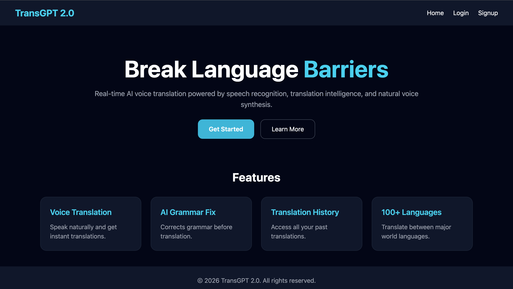
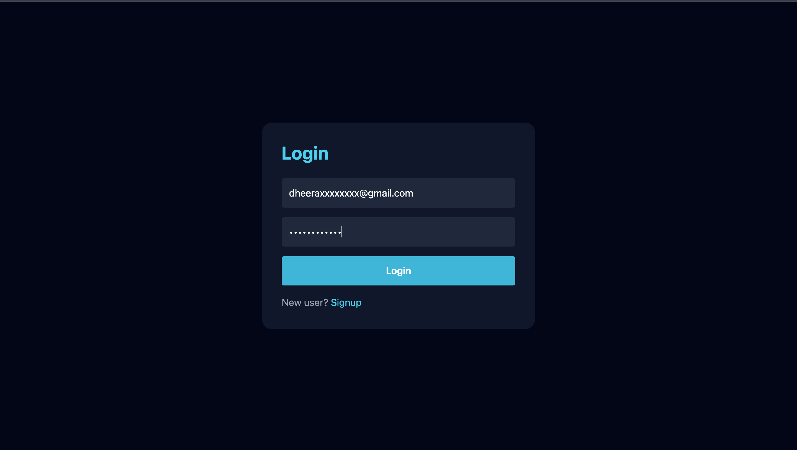
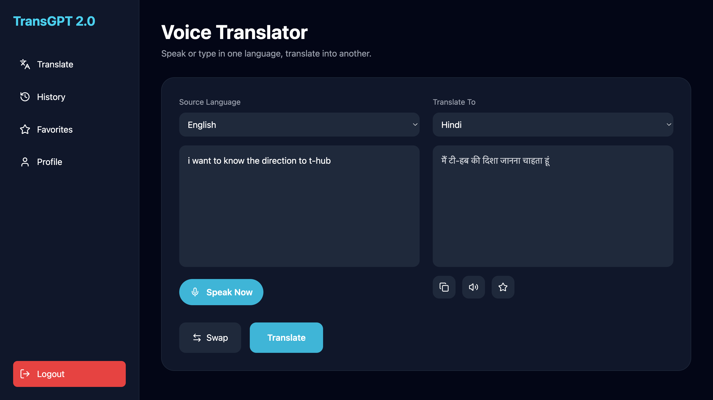
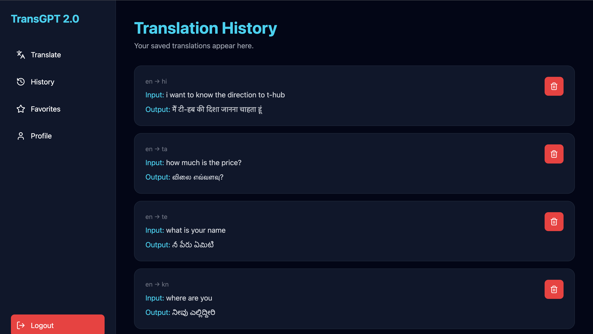
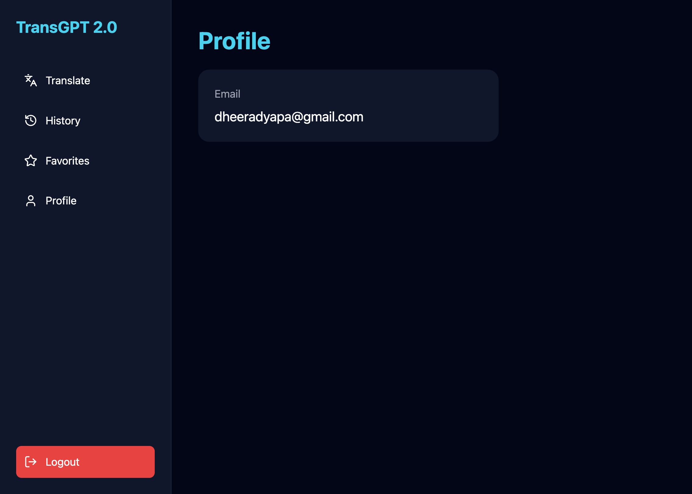

# TransGPT 2.0

TransGPT 2.0 is an AI-powered voice translation platform that enables users to translate text and speech between multiple languages in real time. The application combines speech recognition, language translation, text-to-speech synthesis, user authentication, and translation history management into a modern and responsive web application.

## Features

* User Authentication with Firebase
* Secure Sign Up and Login
* Real-Time Language Translation
* Voice Input using Speech Recognition
* Text-to-Speech Output
* Translation History Management
* User Profile Dashboard
* Multi-Language Support
* Responsive Modern UI
* FastAPI Backend Integration

## Tech Stack

### Frontend

* React.js
* Vite
* Tailwind CSS
* React Router
* Lucide React Icons

### Backend

* FastAPI
* Python
* Deep Translator

### Database & Authentication

* Firebase Authentication
* Cloud Firestore

## Project Structure

```text
TransGPT-2.0
├── backend
│   ├── app
│   │   ├── routes
│   │   ├── services
│   │   └── main.py
│   ├── requirements.txt
│   └── venv
│
├── frontend
│   ├── src
│   ├── public
│   ├── package.json
│   └── vite.config.js
│
├── screenshots
│   ├── landing-page.png
│   ├── login-page.png
│   ├── dashboard.png
│   ├── history-page.png
│   └── profile-page.png
│
└── README.md
```

## Screenshots

### Landing Page



### Login Page



### Dashboard



### History Page



### Profile Page



## Installation

### Clone the Repository

```bash
git clone https://github.com/dheeraaaa/TransGPT-2.0.git
cd TransGPT-2.0
```

### Frontend Setup

```bash
cd frontend
npm install
npm run dev
```

### Backend Setup

```bash
cd backend
python3 -m venv venv
source venv/bin/activate

pip install -r requirements.txt

uvicorn app.main:app --reload
```

### Backend URL

```text
http://127.0.0.1:8000
```

### Frontend URL

```text
http://localhost:5173
```

## Future Enhancements

* Voice-to-Voice Translation
* AI Grammar Correction
* Translation Analytics Dashboard
* Export Translation History
* Favorites Management
* Mobile Application Support
* OCR-Based Image Translation
* PDF Translation Support

## About the Developer

Dheera Dyapa

Bachelor of Technology in Computer Science(AIML)
Malla Reddy University, HYD

Interested in Artificial Intelligence, Machine Learning, and Full-Stack Development.

## License

This project is intended for educational, learning, and portfolio purposes.
